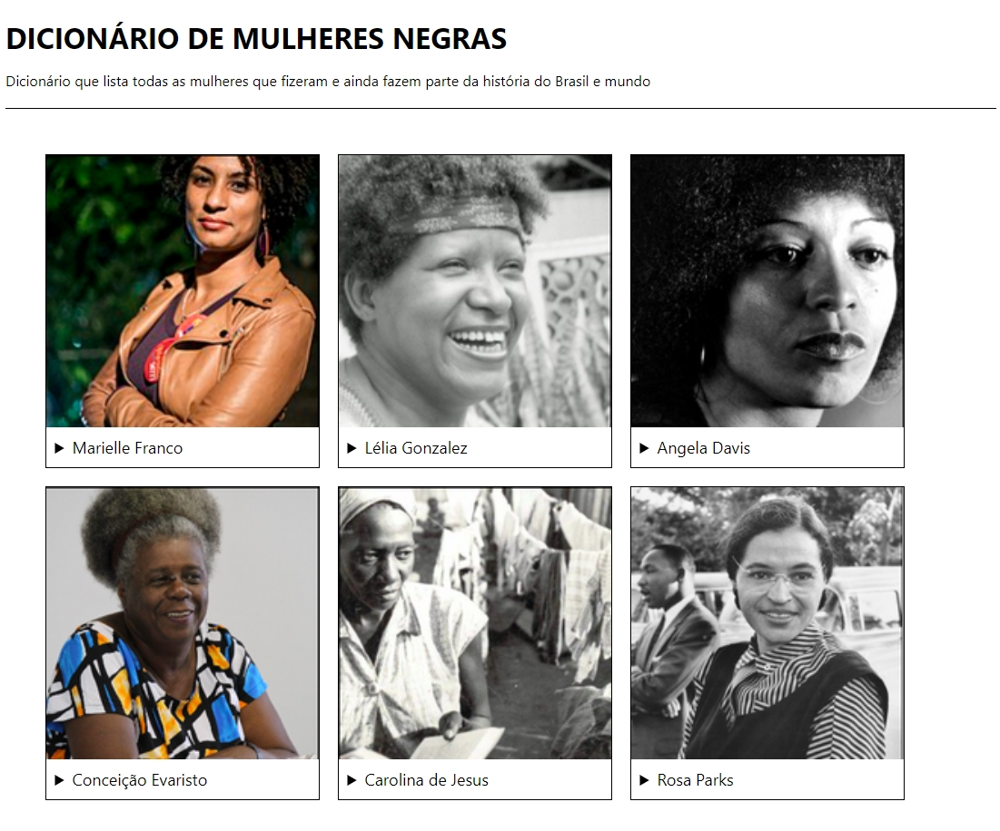

<h1 align="center">
    
</h1>

  :white_check_mark: <a href="https://andreadcsousa.github.io/programaria_frontend2/" target="_blank">Veja a página</a>&nbsp;&nbsp;&nbsp;|&nbsp;&nbsp;&nbsp;
  :white_check_mark: <a href="https://www.programaria.org/" target="_blank">Conheça a PrograMaria</a>

# :computer: Projeto
 
- Idealizador: PrograMaria
- Projeto: Eu ProgrAmo
- Lado da força: Front-End
- Tipo: 1ª Turma curso 2
- Etapa: Curso intermediário

# :rocket: Tecnologias

Esse projeto foi desenvolvido com:

# :art: Layout

